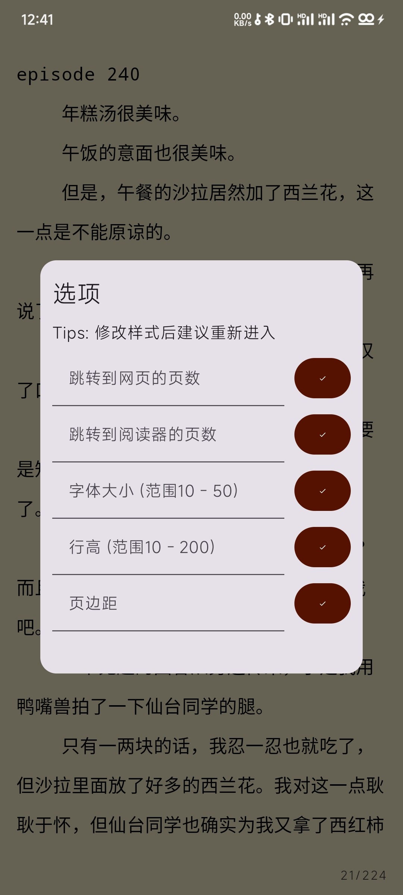

# 300文学阅读器

为百合会论坛小说提供更好的阅读体验，支持阅读点记忆、左右滑动翻页、跳页等常见阅读器功能，同时为其漫画阅读提供有限支持（能缩放，但是左右滑动有点卡）

系统要求: Android 7.0及以上

PS: 因为平时事情比较多，维护频率应该不会很高

## 内容列表

- [已知问题](#已知问题)
- [软件下载](#软件下载)
- [开源许可](#开源许可)
- [如何贡献](#如何贡献)
- [使用许可](#使用许可)

## 已知问题

1. 收藏列表不会自动刷新，登录后请手动点击右上角刷新
2. 网页翻页后页边距不正常，需要重新进入

## 软件下载

[Github Release](https://github.com/flben233/YamiboReader/releases)

[蓝奏云分流(手机使用浏览器打开后以电脑方式浏览，密码:he2j)](https://wwqx.lanzoul.com/b04371uhi)

## 软件截图

  
  
  
  
  

## 开源许可

架构: [Jetpack Compose](https://developer.android.com/jetpack/compose)

网络: [Retrofit](https://github.com/square/retrofit)

网络: [Okhttp3](https://github.com/square/okhttp)

HTML解析: [Jsoup](https://github.com/jhy/jsoup)

JSON解析: [FastJSON2](https://github.com/alibaba/fastjson2)

图片显示: [coil](https://github.com/coil-kt/coil)

## 维护者

[@flben233](https://github.com/flben233)

## 如何贡献

非常欢迎你的加入！[提一个 Issue](https://github.com/flben233/YamiboReader/issues/new) 或者提交一个 Pull Request。

## 使用许可

[AGPL 3.0](LICENSE) © flben233

